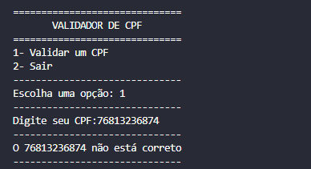

## Verificador de CPF
---

✅ Descrição
    Este projeto é um verificador de CPF feito em Python. Ele recebe um número de CPF, limpa a entrada e valida se o CPF é verdadeiro ou falso com base nos dígitos verificadores.
---

📌 Funcionalidades
    Validação de CPF individual

    Limpeza de caracteres (aceita CPF com ou sem pontos e traços)

    Mensagens de erro amigáveis

    Interface no terminal (com menu simples)
---

📸 Exemplo no terminal
